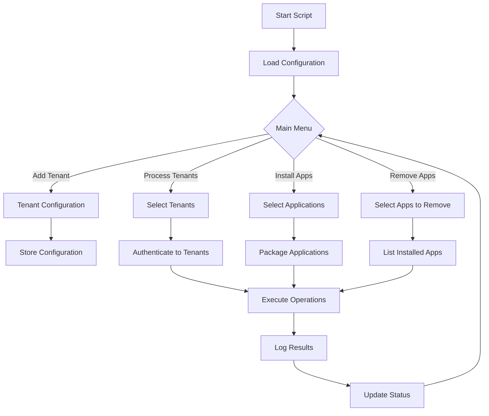

# 🚀 IntuneWin32App-MultiTenant

> 🎯 **A PowerShell script to manage multiple Azure AD tenants and Intune Win32 apps, offering functionality to add new tenants, process existing ones, and install/remove applications.**

## ✨ Overview

**IntuneWin32App-MultiTenant** is a powerful PowerShell-based solution designed to streamline the management of Win32 applications across multiple Azure AD tenants in Microsoft Intune. Whether you're an MSP managing multiple clients or an enterprise with multiple subsidiaries, this tool simplifies the complex task of deploying and managing applications across different organizational boundaries.

### 🎬 Key Use Cases

- 🏢 **Managed Service Providers (MSPs)** - Manage applications for multiple client organizations
- 🌍 **Multi-national Corporations** - Deploy apps across regional subsidiaries
- 👥 **IT Consultants** - Efficiently manage client environments
- 🏗️ **Enterprise IT** - Standardize app deployment across business units

## 🎯 Features

### 🔐 Tenant Management
- ✅ **Add New Tenants** - Easily onboard new Azure AD tenants
- ✅ **Process Existing Tenants** - Bulk operations on configured tenants
- ✅ **Tenant Configuration Storage** - Securely store tenant configurations
- ✅ **Multi-Authentication Support** - Support for various auth methods

### 📦 Application Management
- ✅ **Install Applications** - Deploy Win32 apps across multiple tenants
- ✅ **Remove Applications** - Uninstall apps from selected tenants
- ✅ **Bulk Operations** - Process multiple apps simultaneously
- ✅ **Application Inventory** - Track deployed applications per tenant

### 🛠️ Advanced Features
- ✅ **Automated Packaging** - Convert installers to .intunewin format
- ✅ **Detection Rules** - Smart detection rule generation
- ✅ **Assignment Management** - Configure app assignments per tenant
- ✅ **Comprehensive Logging** - Detailed logs for troubleshooting
- ✅ **Error Handling** - Robust error handling and retry logic

## 📦 Prerequisites

Before you begin, ensure you have met the following requirements:

### System Requirements
- ✅ **Operating System**: Windows 10/11 or Windows Server 2019+
- ✅ **PowerShell**: Version 5.1 or higher
- ✅ **Internet Connection**: Required for Azure AD authentication

### Required Modules
```powershell
# Check PowerShell version
$PSVersionTable.PSVersion

# Required PowerShell modules
- IntuneWin32App (Latest version)
- Microsoft.Graph.Authentication
- Microsoft.Graph.Intune
- AzureAD or Microsoft.Graph
```

### Azure AD Requirements
- ✅ **Azure AD App Registration** per tenant
- ✅ **Admin Consent** granted for required permissions

### 🔑 Required API Permissions

Your Azure AD App Registration needs the following Microsoft Graph API permissions:

| Permission | Type | Description |
|------------|------|-------------|
| `DeviceManagementApps.ReadWrite.All` | Application | Manage Intune apps |
| `Directory.Read.All` | Application | Read directory data |
| `Group.Read.All` | Application | Read group information |
| `User.Read.All` | Application | Read user profiles |

## 🔧 Installation

### Step 1: Clone the Repository

```powershell
# Clone the repository
git clone https://github.com/xxxmtixxx/IntuneWin32App-MultiTenant.git

# Navigate to the directory
cd IntuneWin32App-MultiTenant
```

### Step 2: Install Required Modules

```powershell
# Install required PowerShell modules
Install-Module -Name IntuneWin32App -Scope CurrentUser -Force
Install-Module -Name Microsoft.Graph.Authentication -Scope CurrentUser -Force
Install-Module -Name Microsoft.Graph.Intune -Scope CurrentUser -Force
```

### Step 3: Configure Script Path

```powershell
# Set execution policy if needed
Set-ExecutionPolicy -ExecutionPolicy RemoteSigned -Scope CurrentUser

# Import the script
. .\IntuneWin32App_Apps_MultiTenant.ps1
```

## 🚀 Quick Start

### 1️⃣ First Time Setup

```powershell
# Initialize the script
.\IntuneWin32App_Apps_MultiTenant.ps1

# Follow the menu prompts:
# 1. Add new tenant
# 2. Configure authentication
# 3. Test connection
```

### 2️⃣ Add a New Tenant

```powershell
# When prompted, provide:
# - Tenant Name (friendly name)
# - Tenant ID (domain.onmicrosoft.com)
# - Client ID (from App Registration)
# - Client Secret or Certificate
```

### 3️⃣ Deploy Your First App

```powershell
# Select option to process existing tenants
# Choose the application to deploy
# Select target tenants
# Monitor the deployment progress
```

## 📖 Usage

### 🎮 Interactive Menu System

The script provides an interactive menu with the following options:

```
========================================
    IntuneWin32App Multi-Tenant Manager
========================================
1. 🆕 Add New Tenant
2. 📋 Process Existing Tenants
3. 📦 Install Applications
4. 🗑️ Remove Applications
5. 📊 View Tenant Status
6. ⚙️ Settings
7. ❌ Exit

Select an option:
```

### 🔐 Authentication Methods

#### Option 1: Client Secret Authentication
```powershell
# Store credentials securely
$TenantId = "contoso.onmicrosoft.com"
$ClientId = "xxxxxxxx-xxxx-xxxx-xxxx-xxxxxxxxxxxx"
$ClientSecret = Read-Host -Prompt "Enter Client Secret" -AsSecureString
```

#### Option 2: Certificate Authentication
```powershell
# Using certificate thumbprint
$TenantId = "contoso.onmicrosoft.com"
$ClientId = "xxxxxxxx-xxxx-xxxx-xxxx-xxxxxxxxxxxx"
$CertThumbprint = "1234567890ABCDEF"
```

### 📦 Application Deployment Workflow

1. **Prepare Your Application**
   ```powershell
   # Place installer files in designated folder
   C:\IntuneApps\AppName\
   ├── Setup.exe or Setup.msi
   ├── Config files (if any)
   └── Additional resources
   ```

2. **Configure Deployment Settings**
   ```powershell
   # Application metadata
   $AppInfo = @{
       DisplayName = "Application Name"
       Description = "Application Description"
       Publisher = "Publisher Name"
       Version = "1.0.0"
   }
   ```

3. **Deploy Across Tenants**
   ```powershell
   # The script will:
   # 1. Package the application
   # 2. Connect to each selected tenant
   # 3. Upload the package
   # 4. Configure detection rules
   # 5. Set assignments
   ```

## ⚙️ Configuration

### 📁 Configuration File Structure

The script stores configurations in JSON format:

```json
{
  "Tenants": [
    {
      "Name": "Contoso Corporation",
      "TenantId": "contoso.onmicrosoft.com",
      "ClientId": "xxxxxxxx-xxxx-xxxx-xxxx-xxxxxxxxxxxx",
      "AuthMethod": "ClientSecret",
      "LastConnected": "2024-01-15T10:30:00"
    },
    {
      "Name": "Fabrikam Inc",
      "TenantId": "fabrikam.onmicrosoft.com",
      "ClientId": "yyyyyyyy-yyyy-yyyy-yyyy-yyyyyyyyyyyy",
      "AuthMethod": "Certificate",
      "CertificateThumbprint": "1234567890ABCDEF",
      "LastConnected": "2024-01-15T11:00:00"
    }
  ],
  "Settings": {
    "LogPath": "C:\\Logs\\IntuneMultiTenant",
    "PackagePath": "C:\\IntunePackages",
    "TempPath": "C:\\Temp\\IntuneMultiTenant"
  }
}
```

### 🎛️ Script Parameters

| Parameter | Description | Default |
|-----------|-------------|---------|
| `ConfigPath` | Path to configuration file | `.\config.json` |
| `LogLevel` | Logging verbosity (Verbose/Info/Warning/Error) | `Info` |
| `MaxRetries` | Maximum retry attempts for failed operations | `3` |
| `TimeoutSeconds` | Timeout for API operations | `300` |

## 📊 Workflow



## 🔒 Security

### 🛡️ Best Practices

1. **🔐 Credential Management**
   - Never hardcode credentials in scripts
   - Use Azure Key Vault for production environments
   - Rotate secrets regularly

2. **🔑 Certificate Security**
   - Store certificates in Windows Certificate Store
   - Use strong key lengths (2048-bit minimum)
   - Set appropriate access permissions

3. **📝 Audit Logging**
   - Enable comprehensive logging
   - Review logs regularly
   - Store logs securely

4. **🚪 Least Privilege**
   - Grant minimum required permissions
   - Use separate app registrations per tenant
   - Regular permission audits
